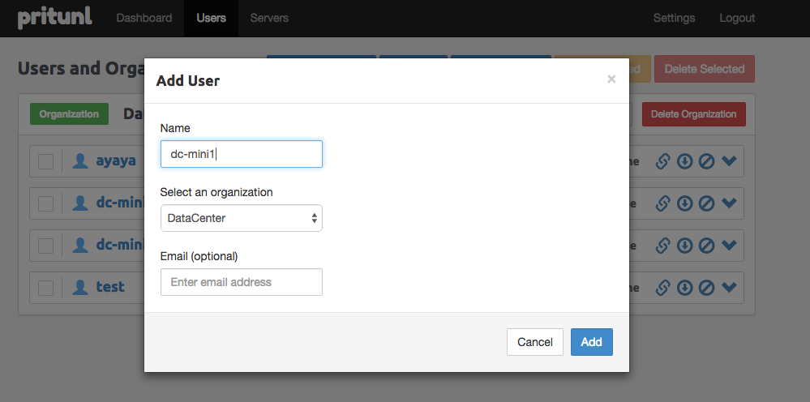
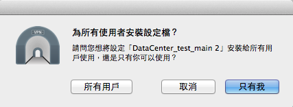
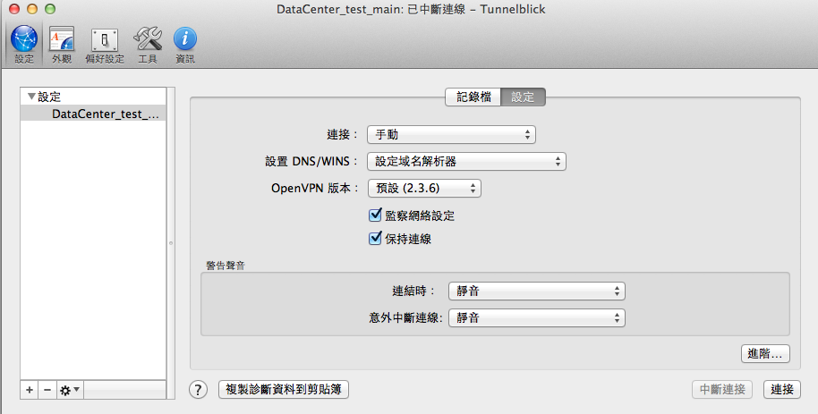

# 製圖機安裝

這可以幫助你建置一個 Ruby 跟 Chef 的環境

## 步驟

### 1.確認使用者為 commandp 及確定是否為`管理者`

如果不是的話先加入使用者 帳號密碼設定為 `commandp` / `commandp`

### 2.把 commandp 加入到 /etc/sudoer

    $ sudo visudo

加入下面這行

    commandp ALL=(ALL) NOPASSWD: ALL

### 下載 osx-cookbook 資料夾

請到 XXXX 下載

### 4.安裝及執行 Chef

    $ ./bootstrap.sh

### 5.上 VPS Server 開帳號，並下載 key 檔

[https://54.65.34.51:9700](https://54.65.34.51:9700)

(目前命名規則為 dc-mini1, dc-mini2, ...)

### 6. 匯入 VPN Key 檔 (.ovpn)

解壓縮後直接點擊兩下匯入安裝，設定「所有用戶」

### 7. 設定保持連結，並連線

### 8. 下載 illustrator

# fix

### 9. 開啟功能

系統偏好設定 / 共享, 打開遠端登入 (ssh) 與螢幕共享 (vnc)

系統偏好設定 / 使用者與群組 / 登入選項, 設定為開機自動登入 commandp

系統偏好設定 / 安全性與隱私, 取消喚醒輸入密碼

系統偏好設定 / 能源節約器, 將避免自動進入睡眠打鉤

別忘了把你的 key 放入 .ssh/authorized_keys

### 10. 本機操作

把 server ip 加入 config/deploy/staging.rb, 跑 cap staging deploy:check, 會幫你建立目錄並跟你說少什麼檔案

從別台 server 複製設定檔, 例如:

    $ scp 'commandp@192.168.0.156:~/deploy/staging/shared/config/*.yml' .
    $ scp *.yml commandp@192.168.0.141:~/deploy/staging/shared/config/

跑 `cap staging deploy:check`, 確定沒少檔案

    $ ssh bitbucket.org

    $ cap staging deploy <- 要跑很久, 可以先去打個桌球

## cookbook 更動備註

### 如果 berksfile 有更改的話

    $ berks vendor vendor/cookbooks

### 執行 chef-solo

    $ chef-solo -c solo.rb -j rolos/macmini.json

